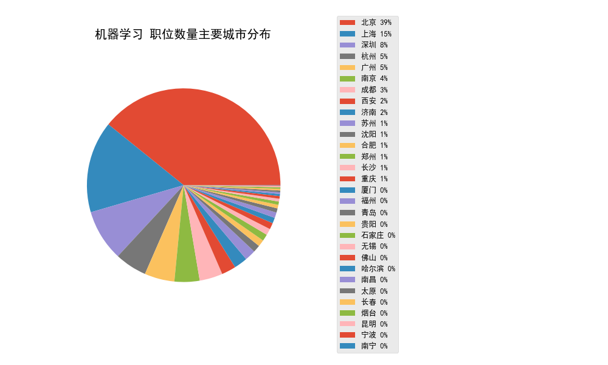
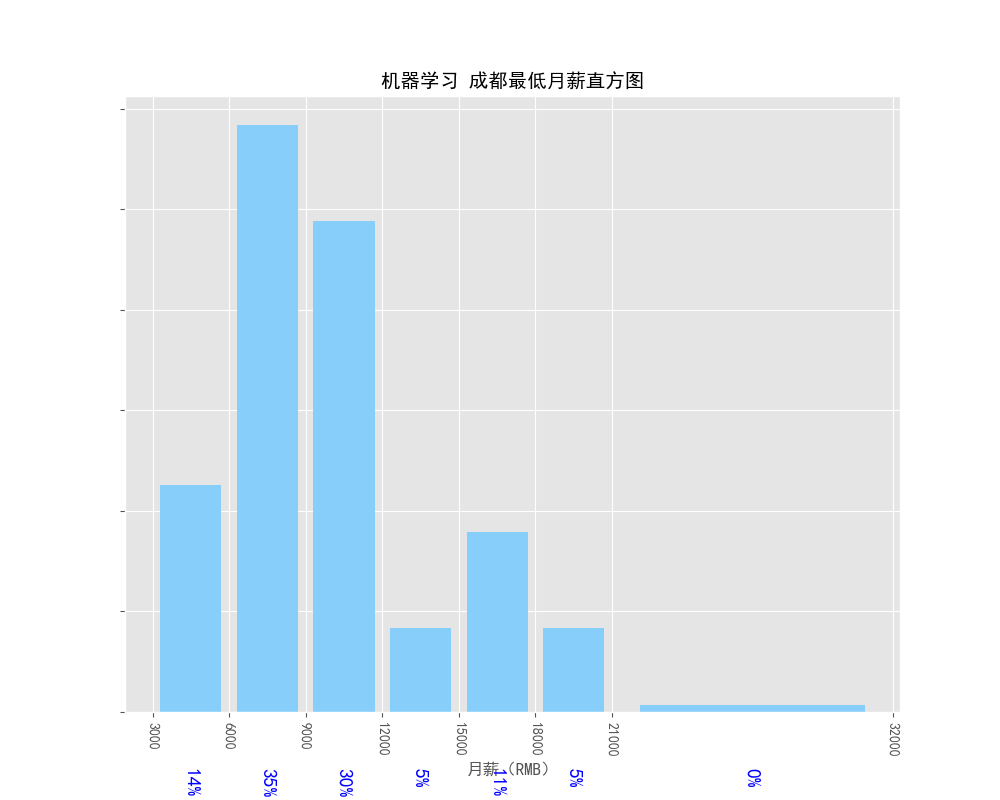

## 爬取智联招聘的爬虫以及简单分析
> 这是一个由Dengju基于网络资料开发的一个Python3项目，可以对相关职位的月薪等信息进行可视化分析

### 功能
1. 通过关键词爬取智联上的相关职位信息
2. 输出信息为Excel表格
3. 输出职位数排名前10的城市信息
4. 输出职位全国的分布情况
5. 分析关键词职位的月薪分布情况
6. 分析职位要求并将数据通过词云图展示
7. 数据可视化，数据库冗余信息清理小工具

### 注意
Windows系统下需要将msyh.ttc字体文件拷贝到res目录下，否则词云图中文将显示乱码
或修改为自己的字体，在config.py文件里修改FONT一项为/res/文件夹下自己的字体文件
注意包含依赖

### 预览
见/images 以及 /data




### 数据库
使用MongoDB数据库，请自行安装配置好MongoDB数据库

### 使用方法
#### 1. 根据需要配置config.py文件
可修改需要爬取的关键词和城市信息

#### 2. 运行zl_spider.py爬取数据
进入tools文件夹，运行zl_spider.py

#### 3. 使用db_op.py清理数据
进入tools文件夹,运行db_op.py，输入要清理的关键词，比如：演员、课程顾问之类的冗余信息

#### 4. 使用ZLAnalyzer.py分析数据
新建一个python文件，如TestCase.py

##### 使用自己的词云图mask
将res目录下的mask改为自己的蒙版图片即可，推荐1600*1600像素以上

运行
```python
__author__ = 'Kevin T. Lee'
from src.ZLAnalyzer import *
ana = Analysis('机器学习') # 第一个参数为需要分析的关键字，第二个参数默认为空，填写需要分析的城市名（已在config中配置的）
ana.easyRun()
```

#### 5. 会在data和images文件夹生成信息
请参见data和images文件夹

### 方法

```python
Analysis.top10City() # 获取职位数量排名前十的城市
Analysis.salaryAnalysis() # 对月薪进行分析
Analysis.saveBrief() # 存取职位简要信息用于生成词云图
Analysis.wordCloud() # 生成词云图
Analysis.easyRun() # 一次运行以上函数
```

### 开源协议
本项目遵循MIT开源协议，参见[许可](/LICENSE) 
